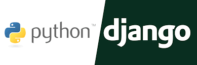
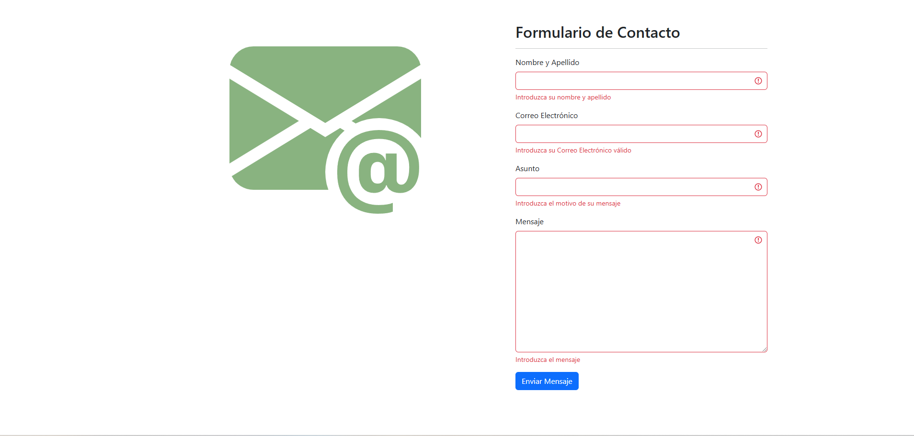

# Proyecto Django: Template para envío de correos electrónicos





Este proyecto de Django proporciona un template personalizable para enviar correos electrónicos de forma sencilla y eficiente.

## Descripción

El objetivo principal de este proyecto es facilitar el envío de correos electrónicos dentro de una aplicación Django, utilizando un template predefinido que se puede personalizar según las necesidades del usuario.

## Características

- **Template personalizable**: El template HTML para los correos electrónicos se puede modificar fácilmente para adaptarlo a la imagen de marca y al contenido deseado.
- **Integración con Django**: El proyecto se integra de forma nativa con el framework Django, lo que permite aprovechar sus funcionalidades para el envío de correos.
- **Fácil de usar**: La configuración y el uso del template son sencillos, lo que permite implementarlo rápidamente en cualquier proyecto Django.

## ✨ Code-base structure

El proyecto viene con una estructura sencilla e intuitiva que se presenta a continuación:
                                                                
```bash
< PROJECT ROOT PUNTO DE VENTA>
 
   |-- core/                               #
   |    |
   |    |-- migration/                     # 
   |    |-- admin.py                       # 
   |    |-- apps.py                        #  
   |    |-- models.py                      #   
   |    |-- test.py                        # 
   |    |-- urls.py                        #
   |    |-- views.py                       #
   |
   |-- emails/                             #
   |    |
   |    |-- asgi.py                        #   
   |    |-- setting.py                     # 
   |    |-- uirls.py                       #
   |    |-- wsgi.py  
   |
   |-- media/                              #
   |    |
   |    |-- image1.ong                     # 
   |    |-- logo.png                       # 
   |
   |-- templates/                          #
   |    |
   |    |-- base.html                      # 
   |    |-- email-template.html            # 
   |    |-- index.html                     #  
   |
   |-- requirements.txt                    # 
   |-- .gitignore   
   |-- db.sqlite3                          # 
   |-- LICENSE                             # 
   |-- manager.py                          # 
   |-- readme.md                           # 
   |
   |-- ************************************************************************
```

<br />

## Instalación


1. Clona el repositorio:
   ```bash
   git clone [https://github.com/jhonshua/Send-Gmail-Django.git]

2. Instalar entorno virtual windows:

   crear: python -m venv env
   activar: env\Scripts\activate

3. Instalar el proyecto:

   pip install -r requirements.txt

4. Arrancar la app:

   python manage.py runserver

